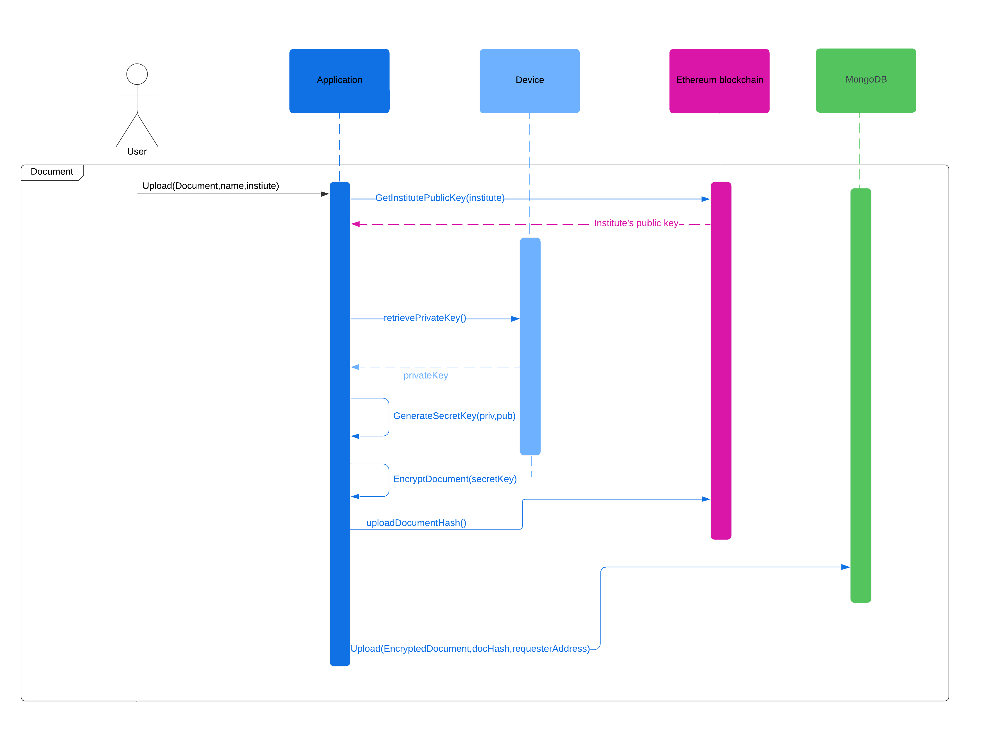
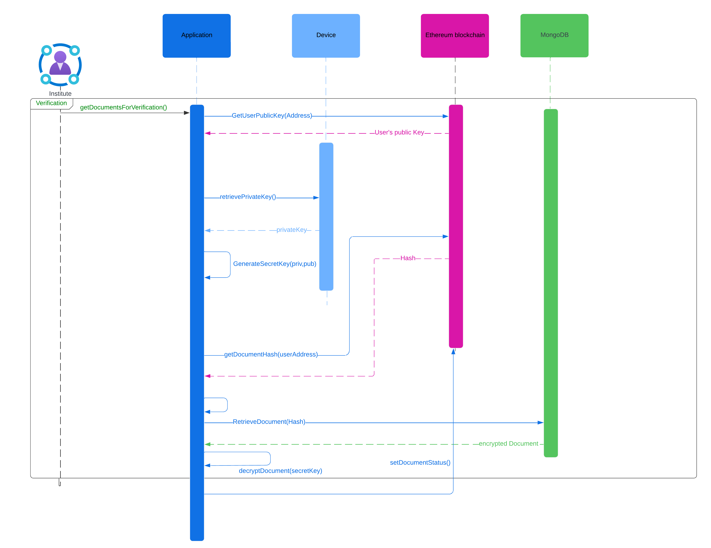

<!-- Improved compatibility of back to top link: See: https://github.com/othneildrew/Best-README-Template/pull/73 -->
<a name="readme-top"></a>
<!--
*** Thanks for checking out the Best-README-Template. If you have a suggestion
*** that would make this better, please fork the repo and create a pull request
*** or simply open an issue with the tag "enhancement".
*** Don't forget to give the project a star!
*** Thanks again! Now go create something AMAZING! :D
-->


<!-- PROJECT SHIELDS -->
<!--
*** I'm using markdown "reference style" links for readability.
*** Reference links are enclosed in brackets [ ] instead of parentheses ( ).
*** See the bottom of this document for the declaration of the reference variables
*** for contributors-url, forks-url, etc. This is an optional, concise syntax you may use.
*** https://www.markdownguide.org/basic-syntax/#reference-style-links
-->


<!-- PROJECT LOGO -->
<br />
<div align="center">

  <h3 align="center">ProofChain</h3>

  <p align="center">
</div>


<!-- TABLE OF CONTENTS -->
<details>
  <summary>Table of Contents</summary>
  <ol>
    <li>
      <a href="#about-the-project">About The Project</a>
      <ul>
        <li><a href="#built-with">Built With</a></li>
      </ul>
    </li>
    <li>
      <a href="#development">Development</a>
      <ul>
        <li><a href="#prerequisites">Prerequisites</a></li>
        <li><a href="#installation">Installation</a></li>
      </ul>
    </li>
    <li><a href="#usage">Usage</a></li>
    <li><a href="#UML">UML</a></li>
    <li><a href="#contributing">Contributing</a></li>
    <li><a href="#license">License</a></li>
    <li><a href="#contact">Contact</a></li>
    <li><a href="#acknowledgments">Acknowledgments</a></li>
  </ol>
</details>


<!-- ABOUT THE PROJECT -->
## About The Project
ProofChain is a document verification desktop application using Ethereum Blockchain
* Document uploaded by user gets stored on mongodb in an encrypted format
* Verifiers can view the document and set the status of document to either approved or rejected
* Third parties can verify the authenticity of documents without seeing it's contents

<p align="right">(<a href="#readme-top">back to top</a>)</p>


### Built With

* [![Go][Go]][Go-url]
* [![React][React.js]][React-url]
* [![Ethereum][Ethereum]][Ethereum-url]
* [![ipfs][ipfs]][ipfs-url]
* [![wails][wails]][wails-url]


<p align="right">(<a href="#readme-top">back to top</a>)</p>


<!-- GETTING STARTED -->
## Development

### Prerequisites

* Ganache
  ```sh
  npm install ganache --global
  ```
* Wails
  ```sh
  go install github.com/wailsapp/wails/v2/cmd/wails@latest
  ```
### Installation


1. Clone the repo
   ```sh
   git clone https://github.com/Raaffs/ProofChain.git
   ```
2. Set up Enviroment variables in `.env` file
    ```
    CLIENT_URL=YOUR_CLIENT_URL
    CONTRACT_ADDR=YOUR_CONTRACT_ADDRESS
    PRIVATE_KEY=YOUR_PRIVATE_KEY
    ```
   
3. Install NPM packages
   ```sh
   cd frontend
   ```
   ```sh
   npm install
   ```
4. Build 
   ```js
   wails build
   ```
### Starting Application
1. Deploy Contract
   ```sh
   go test -v -run TestDeploy
   ```
   
2. Launch Application

   ```sh
   ./build/bin/ProofChain
   ```
<p align="right">(<a href="#readme-top">back to top</a>)</p>


<!-- USAGE EXAMPLES -->
## Usage

<p align="right">(<a href="#readme-top">back to top</a>)</p>


<!-- UML -->
## UML
 ### 1. Uploading Documents

---
 ### 2. Verification

---
 ### 3. API to check integrity of documents

---
<p align="right">(<a href="#readme-top">back to top</a>)</p>


<!-- CONTRIBUTING -->
## Contributing


If you have a suggestion that would make this better, please fork the repo and create a pull request. You can also simply open an issue with the tag "enhancement".
Don't forget to give the project a star! Thanks again!
<p align="right">(<a href="#readme-top">back to top</a>)</p>


<!-- LICENSE -->
## License


<p align="right">(<a href="#readme-top">back to top</a>)</p>


<!-- CONTACT -->
## Contact

Suyash - suyashsaraf5@gmail.com


<p align="right">(<a href="#readme-top">back to top</a>)</p>


<!-- ACKNOWLEDGMENTS -->
## Acknowledgments


<p align="right">(<a href="#readme-top">back to top</a>)</p>


<!-- MARKDOWN LINKS & IMAGES -->
<!-- https://www.markdownguide.org/basic-syntax/#reference-style-links -->
[contributors-shield]: https://img.shields.io/github/contributors/othneildrew/Best-README-Template.svg?style=for-the-badge
[contributors-url]: https://github.com/othneildrew/Best-README-Template/graphs/contributors
[forks-shield]: https://img.shields.io/github/forks/othneildrew/Best-README-Template.svg?style=for-the-badge
[forks-url]: https://github.com/othneildrew/Best-README-Template/network/members
[stars-shield]: https://img.shields.io/github/stars/othneildrew/Best-README-Template.svg?style=for-the-badge
[stars-url]: https://github.com/othneildrew/Best-README-Template/stargazers
[issues-shield]: https://img.shields.io/github/issues/othneildrew/Best-README-Template.svg?style=for-the-badge
[issues-url]: https://github.com/othneildrew/Best-README-Template/issues
[license-shield]: https://img.shields.io/github/license/othneildrew/Best-README-Template.svg?style=for-the-badge
[license-url]: https://github.com/othneildrew/Best-README-Template/blob/master/LICENSE.txt
[linkedin-shield]: https://img.shields.io/badge/-LinkedIn-black.svg?style=for-the-badge&logo=linkedin&colorB=555
[linkedin-url]: https://linkedin.com/in/othneildrew
[product-screenshot]: images/screenshot.png
[Go]: https://img.shields.io/badge/Go-00ADD8?style=for-the-badge&logo=go&logoColor=white
[Go-url]: https://go.dev/
[React.js]: https://img.shields.io/badge/React-20232A?style=for-the-badge&logo=react&logoColor=61DAFB
[React-url]: https://reactjs.org/
[Ethereum]: https://img.shields.io/badge/Ethereum-3C3C3D?style=for-the-badge&logo=Ethereum&logoColor=white
[Ethereum-url]: https://ethereum.org/
[ipfs]: https://img.shields.io/badge/ipfs-blue?style=for-the-badge&logo=ipfs
[ipfs-url]: https://ipfs.tech
[wails]: https://img.shields.io/badge/wails-red?style=for-the-badge&logo=wails
[wails-url]: https://wails.io
[Bootstrap.com]: https://img.shields.io/badge/Bootstrap-563D7C?style=for-the-badge&logo=bootstrap&logoColor=white
[Bootstrap-url]: https://getbootstrap.com
[JQuery.com]: https://img.shields.io/badge/jQuery-0769AD?style=for-the-badge&logo=jquery&logoColor=white
[JQuery-url]: https://jquery.com 
